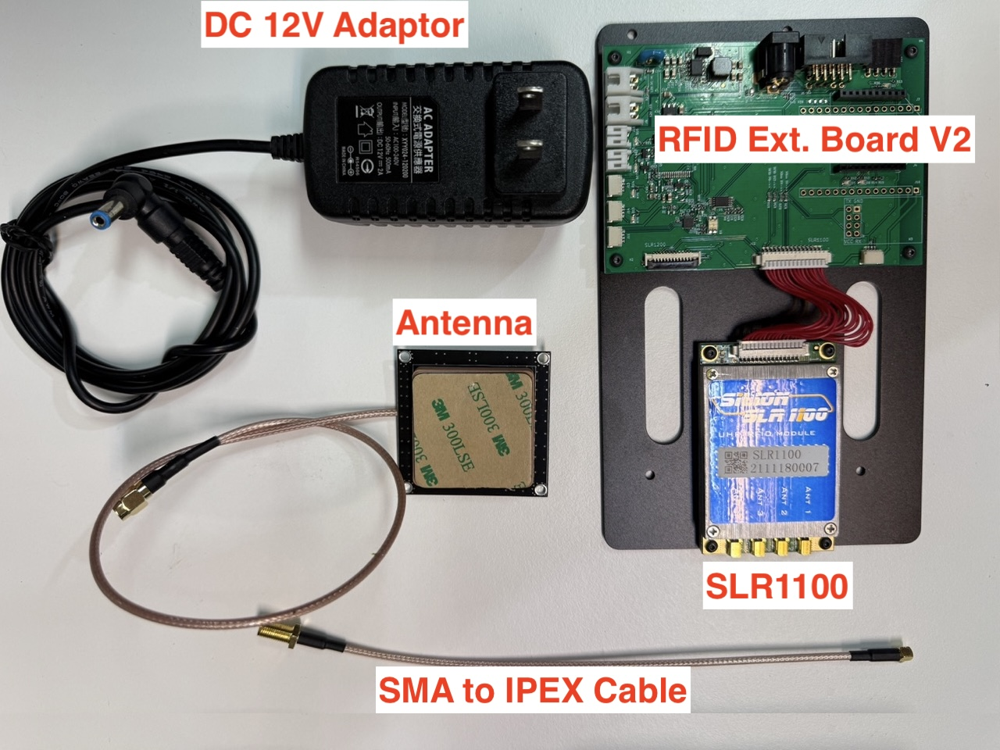
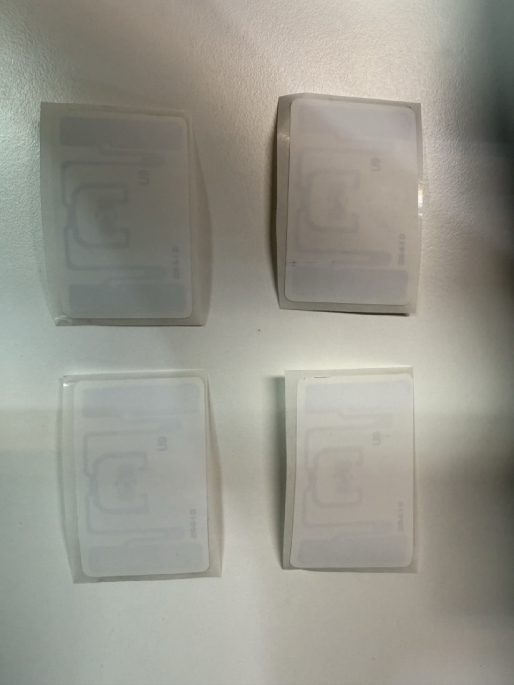
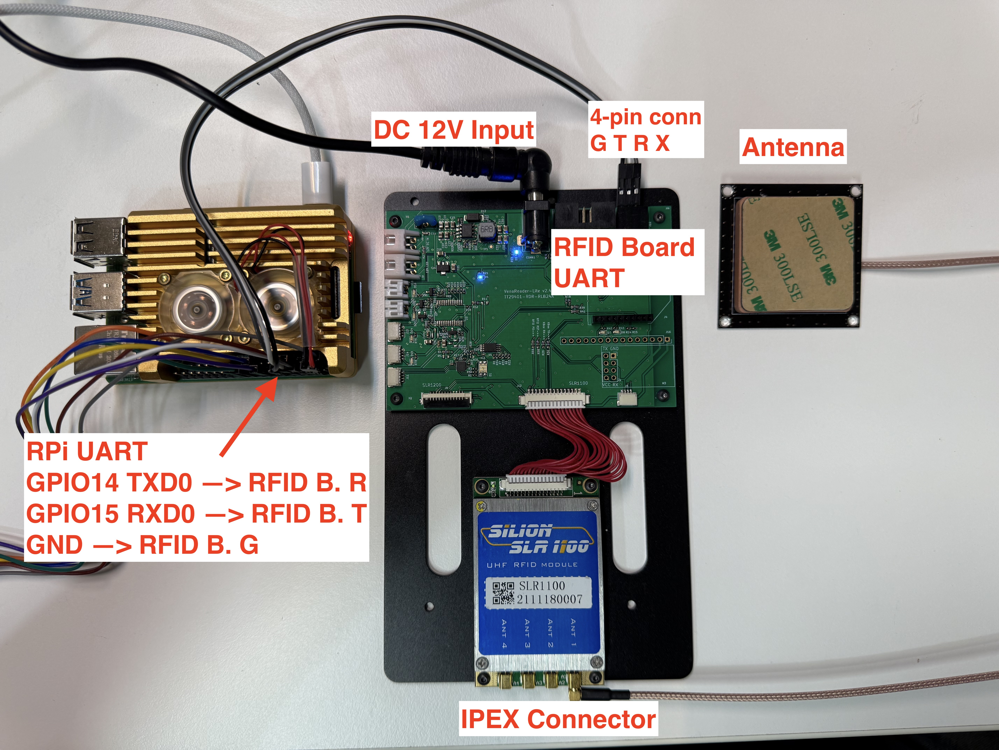
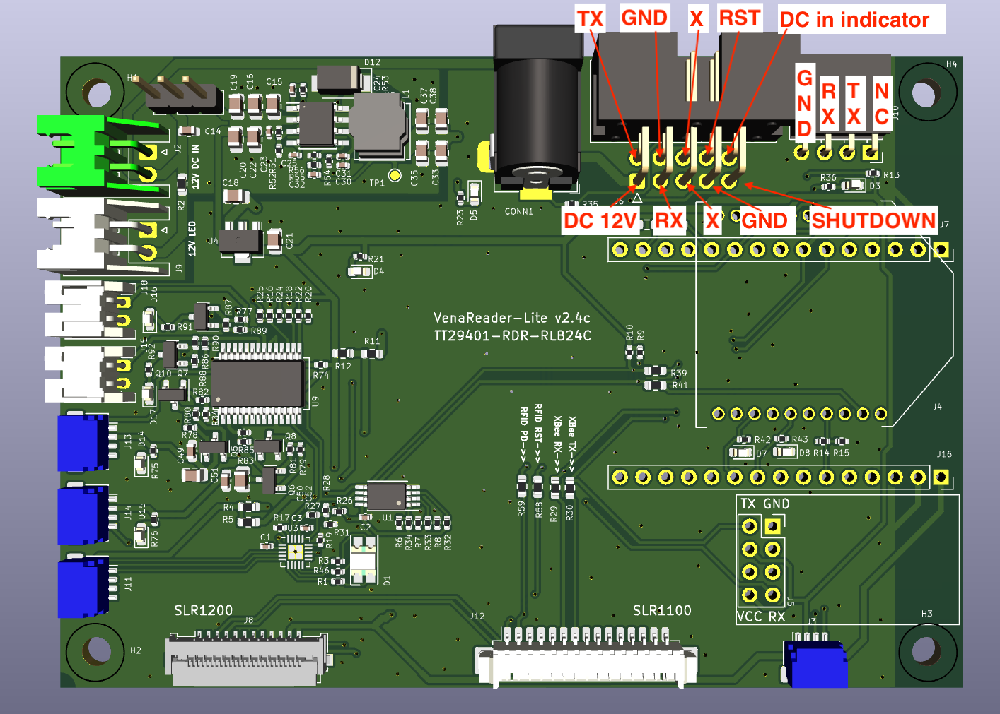
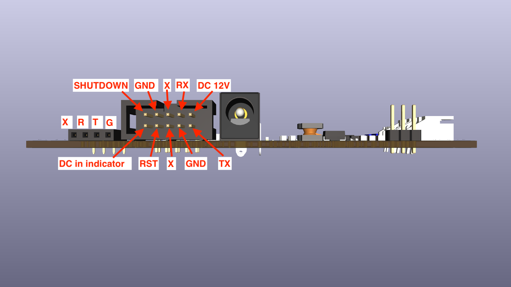

# **RFID Inventory**

This project is a web-based application for tracking RFID tags. It uses a Node.js backend to communicate with an RFID reader via a serial port and a simple front-end to display real-time inventory updates.

The application supports different modes of operation, including an inventory mode that filters scanned tags against a predefined inventory list.

## **How it Works**

The system operates as a single-process application:

1. **Server Initialization**: When index.js starts, it launches an Express web server and a WebSocket server.  
2. **Serial Port Communication**: It connects directly to the specified serial port, handling low-level RFID protocol bytes.  
3. **Inventory Loading**: If configured, it reads the inventory.csv file and loads the EPCs and item names into an in-memory map.  
4. **Web Client Interaction**: A user opens index.html in their browser, which establishes a WebSocket connection.  
5. **Data Exchange**: When the user clicks "Start Scanning," a command is sent via WebSocket to the server. The server, in turn, sends the appropriate hex command to the RFID reader.  
6. **Real-time Updates**: As the RFID reader scans tags, the index.js script processes the data. It filters the results based on the inventory and refresh period, then sends a JSON payload to all connected web clients via WebSocket.  
7. **UI Refresh**: The app.js file on the client-side receives the JSON data, updates its internal state, and redrawing the table on the webpage to reflect the latest scan results.
## **Folder Structure**

The project is organized into the following directory structure:

```
├── index.js                  # Main application file (combines server and RFID logic)  
├── README.md                 # Project documentation  
├── web-app  
│   ├── app.js                # Front-end JavaScript for real-time updates  
│   ├── index.html            # The main web page UI  
│   └── style.css             # Styling for the web page  
└── work  
    └── inventory.csv         # Main inventory list for all other items
```

## **Files Overview**

* **index.js**: This is the core of the application. It runs a web server with a WebSocket gateway and directly manages the serial communication with the RFID reader. It handles the RFID protocol, processes incoming data, and sends updates to the connected web clients.  
* **web-app/index.html**: The single-page web interface. It contains a table to display the inventory status, buttons to control the scanning process, and a status indicator for the WebSocket connection.  
* **web-app/app.js**: The client-side logic. It establishes a WebSocket connection with the server, listens for inventory updates, and dynamically updates the table on the webpage. It also handles user interaction with the "Start" and "Stop" buttons.  
* **web-app/style.css**: The stylesheet for the web interface, providing a clean and responsive design.  
* **work/inventory.csv**: A CSV file containing the master list of RFID tags to be tracked. The columns are id, EPC, and item.  

## **Usage**

### **Prerequisites**

Before you begin, ensure you have the following hardware:

* **Hardware in the RFID-Inventory Kit**
   * An RFID reader module (e.g., model SLR1100 with antenna)

   * UHF RFID tags for your items


* **Hardware NOT in the Kit**
  * Raspberry Pi 4
  * microSD card (32GB)


### **Hardware Setup**
* Wire the J10 connector to the Raspberry Pi 4 and plugin the DC adaptor as below: 


  
* The pinout of `J10` near by the upper right coner is illustrated as below. 


**J10 Pinout from `left` to `right` :**
  * `p1`: GND
  * `p2`: SLR1100 `UART Rx` (will connect to Raspberry Pi `GPIO14 TXD0`)
  * `p3`: SLR1100 `UART Tx` (will connect to Raspberry Pi `GPIO15 RXD0`)
  * `04`: not in use. 

* [Optional] Here is the pinout of the connector for the 10-pin ribbon cable. This is for those who is confident on building a customized ribbon cable which has DC 12V, UART port, and the other GPIO control.



### **Software Setup**

1. **Install Raspberry Pi Imager**: Download and install the [Raspberry Pi Imager](https://www.raspberrypi.com/software/) on your computer.  
2. **Flash the OS Image**: Use the imager to flash the **Raspberry Pi OS (64-bit)** onto your microSD card. Before writing the image, click the settings icon (⚙️) to configure the OS. Make sure to:  
   * Set the hostname to `rfid-inventory.local` .
   * Configure your Wi-Fi SSID and password to make Raspberry Pi connect to your WiFi AP.
3. **Boot the Pi**: Insert the microSD card into your Raspberry Pi and power it on.
4. **Login the Pi**: Wait for 1 minute and login the Pi with the following command if it is connected to the WiFi AP and the hostname is set to `rfid-inventory.local` properly. (The password is `raspberry` by default)

```bash
# run this command on your host PC
ssh pi@rfid-inventory.local
```

5. **Enable the Serial Port Hardware:**
   * Once logged in the Raspberry Pi 4, oppen the Raspberry Pi Configuration tool from the terminal:

```bash
# run this command on Raspberry Pi 4
sudo raspi-config
```
   * Navigate to **3 Interface Options** -\> **I6 Serial Port**.
   * When asked "Would you like a login shell to be accessible over serial?", select **No**.
   * When asked "Would you like the serial port hardware to be enabled?", select **Yes**.
   * Select **Finish** and reboot your Raspberry Pi when prompted.
   * Once it's rebooted, login Raspberry Pi with the following command.

```bash
# run this command on your host PC
ssh pi@rfid-inventory.local
```

   * If you run everything above right, the UART port of TXD0/RXD0 will be available as `/dev/serial0` and `/dev/ttyS0` on Raspberry Pi 4. 


### **Setup the software on Raspberry Pi 4**

First, git clone the code with the following command 

```bash 
git clone https://github.com/clementyu/rfid-inventory.git
```

After cloning the source code, navigate to the project directory and enable the environment variables.

```bash
cd rfid-inventory
cp ./env-sample.md ./.env
```

Next, you need to install **nvm (Node Version Manager)** to easily manage your Node.js versions.

```bash
curl -o- https://raw.githubusercontent.com/nvm-sh/nvm/v0.39.7/install.sh | bash
```

After installation, reload your terminal. Then, install Node.js v22 and set it as the default version.

```bash
nvm install 22  
nvm use 22
```

The project also requires the express, ws, and serialport packages. You can install them by running:

```bash
cd /home/pi/rfid-inventory
npm install express ws serialport
```

### **Preparing the Inventory**

The application uses an inventory file to identify items. You must create this file and populate it with your RFID tag information. If you have the UHF RFID tags and know the EPC of these tags, you can simply edit and prepare the inventory list, `work/inventory.csv`,  in the following steps.

1.  Open the **`work/inventory.csv`** file in a text editor or spreadsheet program.
2.  Populate the file with three columns: **`id`**, **`EPC`** (the unique code from your RFID tag), and **`item`** (the item name, e.g., "butter" or "apple"). For example:
```csv
id,EPC,item
5,E28069150000401F7AB5E9BB,salad
6,E28069150000401F7AB601BB,cheese
7,E28069150000401F7AB5FDBB,butter
8,E28069150000401F7AB5D5BB,turkey-ham
```
1. The system calculate the number of the items by checking the EPC in the same item, for instance, in the list above, there are 2 EPCs in the same item, `turkey-ham`. If both EPCs of `turkey-ham` are scanned, the quantity of will be 2 on the `web interface` which will be talked about later.

### **Running the Application**

To start the application, run the index.js file with Node.js.

```bash
node index.js --mode=inventory --inventory=/home/pi/rfid-inventory/work/inventory.csv --refresh-period=5 --dbg=0 -p /dev/ttyS0 -b 115200
```

By default, the application will start in inventory mode and check for the inventory.csv file. The `web interface` will be available at http://rfid-inventory.local:8080.

### **Command-Line Arguments**

You can customize the application's behavior using the following command-line arguments:

| Argument | Description | Example |
| :---- | :---- | :---- |
| \--mode=\<mode\> | Sets the operational mode. Available modes are auto, inventory, and interactive. auto and inventory modes automatically start the scanning process. inventory mode filters the scanned tags against the provided inventory list. | \--mode=inventory |
| \--inventory=\<path\> | Specifies the path to the inventory CSV file. This is mandatory for inventory mode. | \--inventory=./work/inventory.csv |
| \--refresh-period=\<seconds\> | Sets the time interval (in seconds) for updating the log on the web page. | \--refresh-period=5 |
| \--dbg=\<0 or 1\> | Enables or disables debug logs. 0 turns logs off, 1 turns them on. Debug logs are on by default. | \--dbg=0 |

### **Using the Web Interface**

1.  Open a web browser on any device on the same network as your Raspberry Pi.
2.  Navigate to **`http://rfid-inventory.local:8080`**.
3.  The web page will display an **Item Summary** and a detailed **All Scanned EPCs** table.
4.  Click the **"Start Scanning"** button to begin the scan session.
5.  As you scan items, the tables will update automatically every refresh period. The `Item Summary` will show a count of each item type, and the `All Scanned EPCs` list will show individual tag information.
6.  Click **"Stop Scanning"** to end the session. This will also trigger the saving of a detailed log.

To **gracefully shut down** the application, press `Ctrl+C` in the terminal where the program is running. A log file named **`epc_scan_data.tsv`** will be saved in your project's root directory.


### [Optional] Make the server running once Raspberry Pi is powered on
Use the following command to launch the RFID Inventory webserver and RFID scanning while Raspberry Pi booted up. 

* Install pm2

```bash
sudo apt install -y nodejs npm
sudo npm install -g pm2
```

* Enable pm2 auto-statup  

```bash
pm2 startup
```

Then you will be prompt a command to enable auto-startup. Copy and paste the command and launch as below. The following command line was what I've received. It might be different in your environment.  

```bash
sudo env PATH=$PATH:/home/pi/.nvm/versions/node/v22.18.0/bin /usr/local/lib/node_modules/pm2/bin/pm2 startup systemd -u pi --hp /home/pi
```

```bash
cd /home/pi/rfid-inventory
pm2 start index.js --name rfid-inventory -- --mode=inventory --inventory=/home/pi/rfid-inventory/work/inventory.csv --refresh-period=5 --dbg=0 -p /dev/ttyS0 -b 115200
pm2 save
sudo reboot -p
```


## SNS
* For more information, join our Discord : https://discord.gg/N8U7PhvV
* Youtube Channel : https://www.youtube.com/channel/UCdotAm5aMYq9y3C1NsNDXeQ
